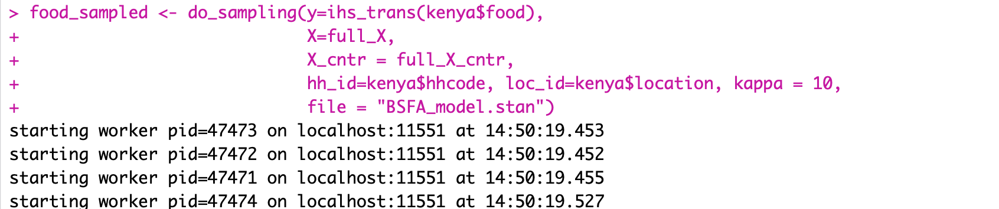

# Cash and Capabilities

Bayesian framework for estimating overall capabilities as well as treatment effects on capabilities, choices, and functionings in the Kenya's unconditional cash-transfer scheme, Cash Transfer for Orphans and Vulnerable Children (CT-OVC).

## Usage
Within your project location, save functions.R, analysis.R, BSFA_model.stan, in subdirectory "src" and ctovc_final.csv in subdirectory "raw_data".

Set your working directory to be your project location You can use setwd(). For example, 
```r
setwd("/Users/Follett/Documents/Research/BSFA")
```

Within this a "output" subdirectory, create two new folders named "Original" and "Matched". This is where the corresponding results and plots will be saved. 

Before you can load the packages, you will need to install them if you have not already done so. Code may look like:
```r
install.packages("rstan") #MCMC sampling
install.packages("ggplot2") #graphics
install.packages("reshape2") #wide-to-long melting
install.packages("plyr") #data manipulation
install.packages("dplyr") #piping, data manipulation
install.packages("tidyr") #data manipulation
install.packages("randomForest") #estimate propensity scores
install.packages("Matching") #matching treatment, control groups
install.packages("loo") #leave one out crossvalidation
```
After each package is installed you can proceed with the code in analysis.R starting with 
```r
library(rstan) #MCMC sampling
library(ggplot2) #graphics
library(reshape2) #wide-to-long melting
library(plyr) #data manipulation
library(dplyr) #piping, data manipulation
library(tidyr) #data manipulation
library(randomForest) #estimate propensity scores
library(Matching) #matching treatment, control groups
library(loo) #leave one out crossvalidation
```


analysis.R will then source functions.R, which contains functions for stan sampling, treatment effect estimation, and plot creation.

Sampling begins with code chunk

```r
food_sampled <- do_sampling(y=ihs_trans(kenya$food),
                            X=full_X, 
                            X_cntr = full_X_cntr,
                            hh_id=kenya$hhcode, loc_id=kenya$location, kappa = 10,
                            file = "BSFA_model.stan")
```

Running this should result in 4 chains being distributed across 4 cores:



The rest of the code will fit the models for the remaining responses and create graphics and tables present in the manuscript. 
